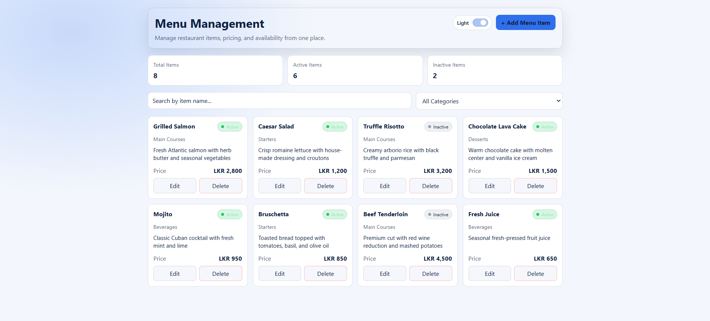
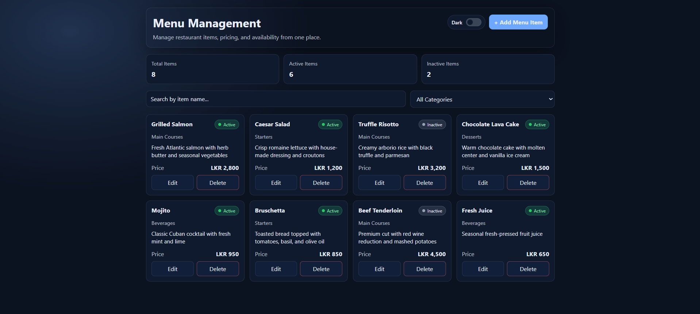
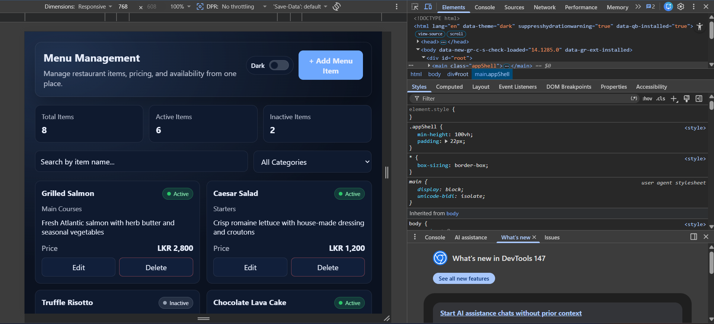

# 🍽️ Menu Management Dashboard

A modern, responsive **React-based dashboard** for managing restaurant menu items.
Built as part of a frontend developer challenge, focusing on clean UI, component structure, and user experience.

---

## 🚀 Live Demo

[netlify link](https://wiigroupfrontendtaskbyanne.netlify.app/)

---

## 📸 Screenshots





---

## 🛠️ Tech Stack

* **React 18 (Vite)**
* **Plain CSS (Custom styling)**
* **JavaScript**

---

## ✨ Features

### 📊 Dashboard

* Display menu items in a responsive card layout
* Price formatted in **LKR currency**
* Visual status indicator (Active / Inactive)
* Responsive grid:

  * Desktop → 3–4 columns
  * Tablet → 2 columns
  * Mobile → 1 column

### 🔍 Search & Filter

* Search menu items by name (real-time)
* Filter by category using dropdown

### ➕ Add Menu Item

* Modal form with:

  * Name (required)
  * Category (required)
  * Description (optional)
  * Price (positive number validation)
  * Status toggle (Active / Inactive)
* Inline validation messages
* Simulated loading state

### ✏️ Edit Menu Item

* Pre-filled modal with existing data
* Update item details seamlessly

### 🗑️ Delete Menu Item

* Confirmation dialog before deletion
* Prevents accidental actions

### 🎨 UI/UX Enhancements

* Clean, modern dashboard layout
* Smooth hover effects and transitions
* Animated components using Framer Motion
* Professional color palette

### 🌙 Dark Mode

* Toggle switch for light/dark theme
* Smooth theme transition

---

## 📁 Project Structure

```
src/
├── components/
│   ├── Dashboard/
│   │   ├── Dashboard.jsx
│   │   └── Dashboard.css
│   ├── MenuItemCard/
│   │   ├── MenuItemCard.jsx
│   │   └── MenuItemCard.css
│   ├── MenuItemModal/
│   │   ├── MenuItemModal.jsx
│   │   └── MenuItemModal.css
│   ├── SearchBar/
│   │   ├── SearchBar.jsx
│   │   └── SearchBar.css
│   ├── CategoryFilter/
│   │   ├── CategoryFilter.jsx
│   │   └── CategoryFilter.css
│   └── ConfirmDialog/
│       ├── ConfirmDialog.jsx
│       └── ConfirmDialog.css
├── data/
│   └── mockData.js
├── styles/
│   ├── global.css
│   └── app.css
├── App.jsx
└── main.jsx
```

---

## ⚙️ Setup Instructions

### 📋 Requirements

* Node.js (v18 or higher)
* npm

### 🔧 Installation

```bash
# Clone the repository
git clone https://github.com/Wannefdo/wii-group-frontend-challenge.git

# Navigate into project
cd menu-dashboard

# Install dependencies
npm install

# Run development server
npm run dev
```

Open in browser:

```
http://localhost:5173
```

---

## 🎯 Design Decisions

* **Component-based architecture**
  → Improves reusability and maintainability

* **Local state management (useState)**
  → Sufficient for this scope without overengineering

* **Plain CSS with variables**
  → Lightweight, customizable, supports dark mode easily

---

## ⏱️ Time Spent

Approximately **4 hours** as per challenge guidelines.

---

## 📌 Notes

* No backend is used (mock data + local state)
* Data resets on refresh (as per requirements)
* Focused on clean UI, UX, and React best practices

---

## 👤 Author

**Anne Fernando**  -  SE Undergraduate

---

## 📬 Submission

* GitHub Repository: [[Repo Link](https://github.com/Wannefdo/wii-group-frontend-challenge.git)]
* Live Demo: [[Deployment Link](https://wiigroupfrontendtaskbyanne.netlify.app/)]
